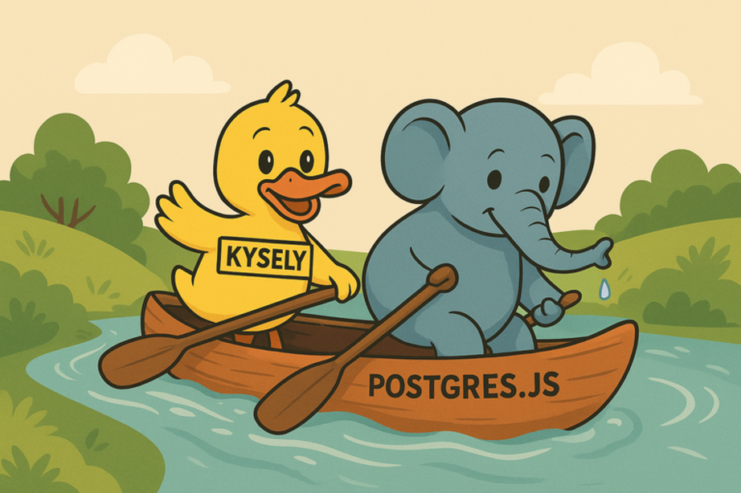

[](https://github.com/kysely-org/kysely-postgres-js/releases/latest)
[](https://github.com/kysely-org/kysely-postgres-js)
[](https://github.com/kysely-org/kysely-postgres-js/blob/main/LICENSE)
[](https://github.com/kysely-org/kysely-postgres-js/issues?q=is%3Aissue+is%3Aopen+sort%3Aupdated-desc)
[](https://github.com/kysely-org/kysely-postgres-js/pulls?q=is%3Apr+is%3Aopen+sort%3Aupdated-desc)

[](https://www.npmjs.com/package/kysely-postgres-js)

###### Join the discussion ⠀⠀⠀⠀⠀⠀⠀

[](https://discord.gg/xyBJ3GwvAm)
[](https://bsky.app/profile/kysely.dev)

`kysely-postgres-js` offers a [Kysely](https://github.com/koskimas/kysely) dialect for [PostgreSQL](https://www.postgresql.org/) that supports the [Postgres.js](https://github.com/porsager/postgres) client library (version >= 3.4) and [Bun](https://bun.com/)'s (version >= 1.2) [SQL](https://bun.com/docs/api/sql) native binding.

This dialect should not be confused with [Kysely](https://github.com/koskimas/kysely)'s core [PostgreSQL](https://www.postgresql.org/) dialect, which supports the significantly more adopted [pg](https://github.com/brianc/node-postgres) client library and [Neon](https://neon.com)'s WebSockets [Pool](https://neon.com/docs/serverless/serverless-driver#use-the-driver-over-websockets) instead. Both of these dialects are maintained by members of the [Kysely](https://github.com/koskimas/kysely) core team and are production ready.

## Installation

### Node.js

```bash
npm install kysely-postgres-js postgres kysely
```

```bash
pnpm add kysely-postgres-js postgres kysely
```

```bash
yarn add kysely-postgres-js postgres kysely
```

### Other runtimes

```bash
deno add npm:kysely-postgres-js npm:postgres npm:kysely
```

```bash
bun add kysely-postgres-js kysely
```

## Usage

### Node.js

```ts
import { type GeneratedAlways, Kysely } from 'kysely'
import { PostgresJSDialect } from 'kysely-postgres-js'
import postgres from 'postgres'

interface Database {
  person: {
    id: GeneratedAlways<number>
    first_name: string | null
    last_name: string | null
    age: number
  }
}

const db = new Kysely<Database>({
  dialect: new PostgresJSDialect({
    postgres: postgres({
      database: 'test',
      host: 'localhost',
      max: 10,
      port: 5434,
      user: 'admin',
    }),
  }),
})

const people = await db.selectFrom("person").selectAll().execute();
```

### Bun

```ts
import { SQL } from 'bun'
import { type GeneratedAlways, Kysely } from 'kysely'
import { PostgresJSDialect } from 'kysely-postgres-js'

interface Database {
  person: {
    id: GeneratedAlways<number>
    first_name: string | null
    last_name: string | null
    age: number
  }
}

const db = new Kysely<Database>({
  dialect: new PostgresJSDialect({
    postgres: new SQL({
      database: 'test',
      host: 'localhost',
      max: 10,
      port: 5434,
      user: 'admin',
    }),
  }),
})

const people = await db.selectFrom("person").selectAll().execute();
```

## Aborting queries

This dialect supports Kysely's `AbortSignal` integration, including the
`'cancel query'` and `'kill session'` values of `inflightQueryAbortStrategy`,
which stop the aborted query on the database side:

```ts
await db
  .selectFrom('person')
  .selectAll()
  .execute({
    signal: AbortSignal.timeout(5_000),
    inflightQueryAbortStrategy: 'kill session',
  })
```

Under the hood, `'cancel query'` uses [Postgres.js](https://github.com/porsager/postgres)'
native wire-protocol cancellation when running on [Postgres.js](https://github.com/porsager/postgres),
and `pg_cancel_backend` on a control connection when running on [Bun](https://bun.com/)'s
[SQL](https://bun.com/docs/api/sql) (whose `cancel()` doesn't cancel queries on
the database side). `'kill session'` executes `pg_terminate_backend` on a
control connection in both cases.

### `controlPostgres`

By default, control queries (e.g. `pg_terminate_backend`) are executed on a
connection acquired from the `postgres` pool. This might mean waiting for an
idle connection, and with a small, saturated pool (e.g. `max: 1`), it can wait
forever - the aborted query's connection is only returned to the pool after
the control query runs.

To avoid this, provide `controlPostgres`. You can pass `postgres` or Bun's
`SQL` directly - it is invoked with the main instance's resolved options, with
`max` overridden to `1`. A custom factory receiving those options works too.
Both libraries' pools are lazy, so the control instance doesn't hold a
connection until the first control query runs.

#### Node.js

```ts
import { Kysely } from 'kysely'
import { PostgresJSDialect } from 'kysely-postgres-js'
import postgres from 'postgres'

const db = new Kysely<Database>({
  dialect: new PostgresJSDialect({
    controlPostgres: postgres,
    postgres: postgres({
      database: 'test',
      host: 'localhost',
      max: 10,
      port: 5434,
      user: 'admin',
    }),
  }),
})
```

#### Bun

```ts
import { SQL } from 'bun'
import { Kysely } from 'kysely'
import { PostgresJSDialect } from 'kysely-postgres-js'

const db = new Kysely<Database>({
  dialect: new PostgresJSDialect({
    controlPostgres: SQL,
    postgres: new SQL({
      database: 'test',
      host: 'localhost',
      max: 10,
      port: 5434,
      user: 'admin',
    }),
  }),
})
```